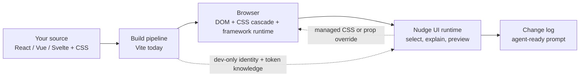
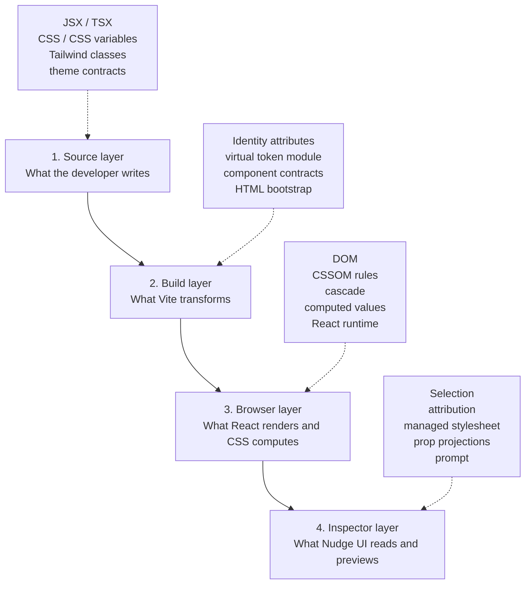
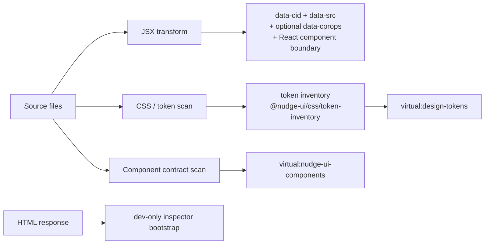
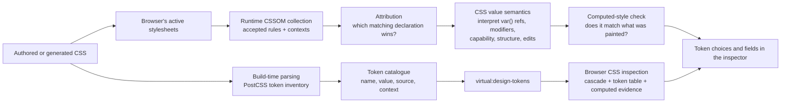
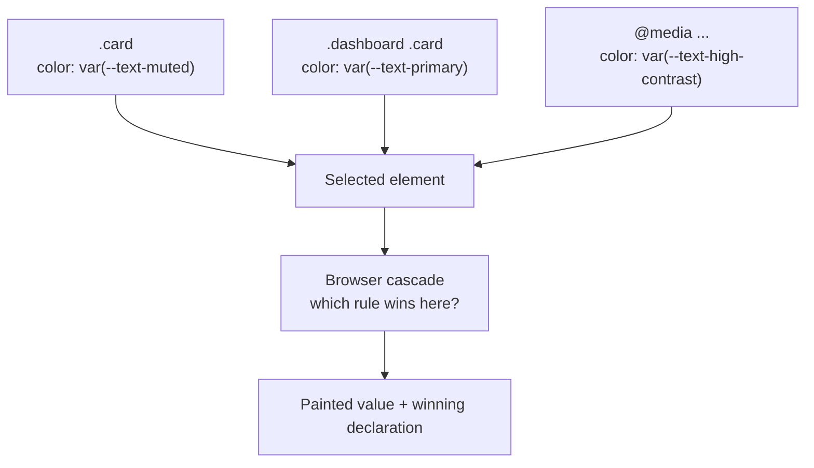
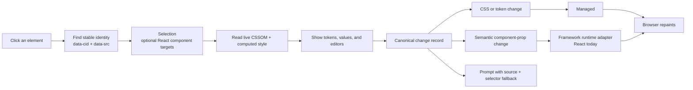
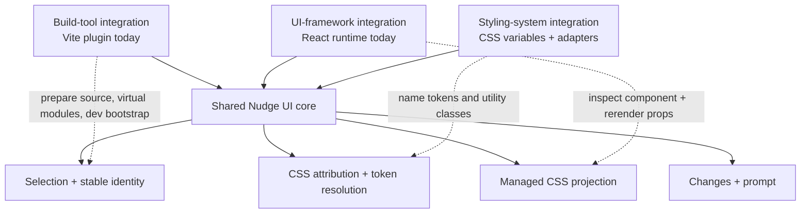
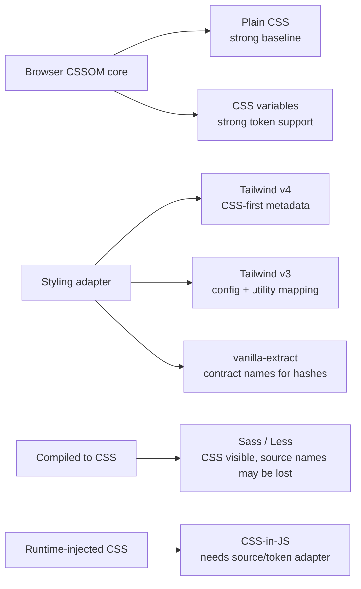
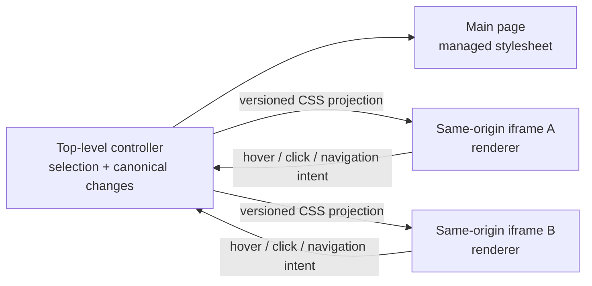

# Nudge UI: a mental model

This is a short, non-technical map of where the Nudge UI fits into a modern
front-end project.

## The one-sentence version

Your app is built first, rendered second, and inspected third. The Nudge UI
does not replace React, CSS, Tailwind, or Vite. It adds a dev-only bridge between
the source code and the browser that is already rendering the app.

The important idea is that there are two different kinds of knowledge:

- **Build-time knowledge:** “This token exists in this file” and “this JSX
  element came from this source location.”
- **Browser-time knowledge:** “This is the rule that actually won the cascade
  for this element right now.”

The inspector needs both. Neither one is enough on its own.

## The four layers

### 1. Source layer: many ways to describe design

The author might write:

- ordinary CSS such as `.card { padding: var(--space-3) }`;
- CSS custom properties in `:root`, a theme class, or Tailwind v4 `@theme`;
- Tailwind utility classes;
- a vanilla-extract or Sprinkles theme contract;
- a component prop such as `<Button variant="quiet" />`.

These are different authoring languages, but they eventually meet in the
browser as DOM elements and CSS rules.

### 2. Build layer: prepare a bridge

In this repository, the Vite plugin has four main jobs during development:

In plain language:

- It gives rendered elements a stable name and source location. Those
  `data-*` attributes are the identity layer that survives React re-renders.
- It discovers and feeds stylesheet artifacts to the token inventory Module
  (`@nudge-ui/css/token-inventory`), which aggregates them into the token
  catalogue published through `virtual:design-tokens`. This is a useful
  inventory, not yet proof that a selected element is using a token.
- It discovers typed component props where it can, so a semantic edit can be
  represented as “change this component prop” rather than as a pile of guessed
  CSS changes.
- It adds the inspector mount point and bootstrap script to dev HTML only.

The Vite plugin is deliberately a thin Adapter: it scans files, resolves the
active CSS import graph, runs transforms, watches for changes, and feeds
observations (authored, transformed, removed, failed) to the inventory. Parsing,
declaration identity, ordering, provenance, merging, diagnostics, and the
generation fingerprint all live in the inventory Module — never in Vite
lifecycle code.

The plugin deliberately does nothing for a production build. Production gets
an empty token module, no inspector bootstrap, and no injected identity.

### 3. Browser layer: the browser is the CSS judge

After Vite and any CSS framework have done their work, the browser receives
ordinary CSS rules. The browser decides which rules apply, taking account of
selectors, specificity, source order, layers, media queries, container queries,
inheritance, and the current DOM.

The inspector reads that live result rather than pretending it can recreate the
entire CSS engine itself.

### 4. Inspector layer: explain, preview, hand off

The runtime inspector lives beside the app in a Shadow DOM. It selects an
element, traces the styles that apply to it, records a structured change, and
projects that change temporarily. It does not edit the source file itself; the
prompt is the hand-off to the coding agent.

## Where CSS parsing, attribution, and token resolution happen

These three words describe different jobs.

### Parsing: “what token definitions exist?”

`@nudge-ui/css/token-inventory` is the build-time aggregator. It parses
global custom-property definitions from stylesheet artifacts, keeps source
location and context such as a theme selector, `@media`, `@supports`, `@scope`,
or `@layer` wrapper, reconciles authored and compiler-transformed observations
of the same file, assigns deterministic declaration identity and order, and
produces one immutable snapshot whose `generation` fingerprint changes exactly
when the observable facts change.

Adapters add knowledge that cannot be recovered from plain CSS alone:

- Tailwind v4 can be recognised from its CSS-first theme output.
- Tailwind v3 can map utility names back to a supplied theme config.
- vanilla-extract/Sprinkles can map hashed CSS variables back to names such as
  `theme.color.brand`.

Think of this catalogue as the inspector’s **dictionary**.

#### Why the inventory is a Module, not a Vite helper

The token inventory passes the deletion test: deleting
`@nudge-ui/css/token-inventory` would force the Vite Adapter to re-own
PostCSS parsing, authored/transformed reconciliation, declaration identity and
ordering, project/package/generated provenance, contribution merging, structured
diagnostics, and the generation fingerprint that `BrowserTokenKnowledge` uses to
refresh inspection sessions. The Adapter would also have to re-solve the
determinism and no-op guarantees that keep equivalent HMR event batches from
churning the snapshot. Because all of that behavior is behind one build-tool
neutral Interface, a future Webpack/Rollup/esbuild integration can feed ordered
artifacts and publish the same snapshot without reimplementing any of it.

### Attribution: “why does this element look like this?”

`packages/inspector/src/tokens/resolution/cssomCollector.ts` walks the browser’s
active CSSOM. `resolution.ts` then matches selectors against the selected
element and compares candidates using cascade rules.

This matters because the same property may be mentioned by many rules:

Attribution is the part that prevents the inspector from saying “the element
uses token X” just because token X exists somewhere in the project.

### Token resolution: "what does that winning declaration mean?"

Once a declaration is found, the CSS value-semantics Module
(`packages/css/src/value-semantics/`) interprets the authored value: it follows
`var(...)` references (including local aliases and framework-generated aliases
such as Tailwind's `--tw-*` variables), attributes modifiers, classifies edit
capability, selects compatible tokens, and performs meaning-preserving edits. It
also understands useful structures such as shorthands, logical spacing, borders,
color opacity, and interaction states. The neutral Module knows nothing about
React, Vite, or the DOM; the resolver feeds it an explicit token table, local
aliases, and writing-mode facts.

`packages/inspector/src/tokens/resolution.ts` no longer interprets CSS
values itself. It coordinates cascade facts — matching, specificity, layers,
inline declarations, and interaction states — and projects the Module's
interpretation onto `ResolvedProperty` rows. UI callers reach value semantics
only through `BrowserCssInspection` (for interpretation) and the semantic edit
Interface (for edits and candidates).

Finally the inspector compares the candidate against the browser's computed
value. That lets the UI communicate confidence:

- **Exact:** the authored token path agrees with the value the browser painted.
- **Probable:** the token is a good authored match, but the browser cannot prove
  the path uniquely (for example because of a cascade layer or inaccessible
  stylesheet).
- **Unknown:** the value is real, but no known token can be attributed to it.

## What happens when you click and edit

There are intentionally two preview mechanisms:

1. **CSS and token edits** become rules in one managed stylesheet. The rule is
   keyed by stable identity, and global token previews preserve the token’s
   authored theme/context. Nothing is written inline onto the tracked element.
2. **Component prop edits** go through a framework adapter. The React adapter
   rerenders the real component with an override. A change such as
   `variant="primary"` → `variant="quiet"` may alter markup, classes,
   accessibility attributes, or behaviour; CSS alone cannot represent that
   intent faithfully.

This distinction is the foundation for supporting more frameworks without
turning the inspector into a mass of framework-specific conditionals.

## How the major tools fit together

The expansion strategy is therefore three-dimensional:

| Layer | Current repository | What a future integration must provide |
|---|---|---|
| Build tool | Vite | A transform/plugin hook, dev HTML/bootstrap hook, virtual-module equivalent, and dev-only guarantees |
| UI framework | React | Source/callsite identity, runtime component inspection, and a safe prop-override mechanism |
| Styling system | CSS variables, Tailwind v3/v4, vanilla-extract/Sprinkles | Token extraction and, where possible, class/utility-to-token attribution |
| Browser core | DOM + CSSOM | Mostly reusable: selection, cascade inspection, computed-style checks, managed stylesheet, changes, prompts |

### Build tools are not UI frameworks

- **Vite or Webpack** answers: “How do source files become browser code, and
  how can a dev plugin participate?”
- **React, Vue, or Svelte** answers: “How do components render and rerender?”
- **Tailwind, Sass, CSS Modules, or vanilla-extract** answers: “How do authors
  describe styles before the browser sees them?”
- **The browser** answers: “Which CSS wins and what value is painted?”
- **Nudge UI** sits across the last two boundaries: it uses the build tool to
  attach source identity, then uses the browser to inspect and preview the
  result.

## What different CSS approaches mean for support

The practical rule is:

- If a styling system leaves useful CSS custom properties in the browser,
  the universal core can often show something immediately.
- If it turns human names into generated classes, hashes, or literal values,
  an adapter is needed to recover the author’s vocabulary.
- If a component prop changes the rendered structure, it belongs in a framework
  adapter, not in CSS attribution.

This is why “supporting Tailwind” and “supporting Vue” are different projects:
Tailwind needs styling/token knowledge; Vue needs component source and runtime
knowledge. They plug into different seams.

## Inspect mode and Canvas mode

Canvas adds more browser runtimes, but it keeps one source of truth:

The frames render real routes. They do not own the inspector or the edit log;
they display the controller’s current CSS projection and report what the user
clicked. This is the same separation again: one authority, many renderers.

## A useful mental checklist

When adding support for a new use case, ask three questions:

1. **Can we identify the source?** Add or adapt the build-time/source transform.
2. **Can we explain what the browser actually did?** Extend the CSSOM or token
   attribution layer only if the browser output is not enough.
3. **Can we preview the author’s intent faithfully?** Use managed CSS for style
   changes, or a framework runtime adapter for semantic component changes.

If the answer is “no” to the third question, do not hide the gap by guessing at
CSS. Record the uncertainty and give the agent a selector/source fallback.

## Where to trace this in the repository

- Build/plugin boundary (thin Vite Adapter: discover, transform, watch, publish): [`packages/plugin/src/index.ts`](../../packages/plugin/src/index.ts)
- JSX identity and React callsite instrumentation: [`packages/plugin/src/transform/injectDataCid.ts`](../../packages/plugin/src/transform/injectDataCid.ts)
- Token inventory (build-time aggregator: parse, reconcile, order, provenance, diagnose, generate): [`packages/css/src/token-inventory/`](../../packages/css/src/token-inventory/)
- Styling adapters (framework-specific extraction into inventory contributions): [`packages/plugin/src/adapters/`](../../packages/plugin/src/adapters/)
- Runtime bootstrap and Shadow DOM mount: [`packages/inspector/src/index.ts`](../../packages/inspector/src/index.ts)
- Browser CSS inspection seam (sole browser inspection authority): [`packages/inspector/src/inspection/browserCssInspection.ts`](../../packages/inspector/src/inspection/browserCssInspection.ts)
- CSSOM collection and attribution: [`packages/inspector/src/tokens/resolution/cssomCollector.ts`](../../packages/inspector/src/tokens/resolution/cssomCollector.ts) and [`packages/inspector/src/tokens/resolution.ts`](../../packages/inspector/src/tokens/resolution.ts)
- CSS value semantics (interpret, select, edit; browser-safe, no Vite/React/PostCSS): [`packages/css/src/value-semantics/`](../../packages/css/src/value-semantics/)
- Shared CSS/token model: [`packages/css/src/model/`](../../packages/css/src/model/)
- Temporary CSS projection: [`packages/inspector/src/managedStylesheet.ts`](../../packages/inspector/src/managedStylesheet.ts) and [`packages/inspector/src/changes/projection.ts`](../../packages/inspector/src/changes/projection.ts)
- Semantic component props: [`packages/inspector/src/componentSemantics/`](../../packages/inspector/src/componentSemantics/)
- Canvas controller/renderer boundary: [`packages/inspector/src/canvas/`](../../packages/inspector/src/canvas/)

The shortest summary is: **build tools give the inspector a map, the browser
gives it evidence, and adapters translate that evidence back into the language
the developer used.**
