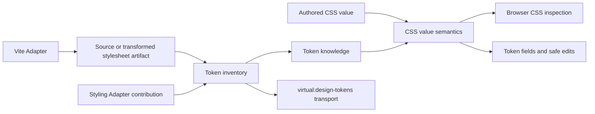

# CSS value semantics and token inventory deepening

**Status:** Proposed implementation plan  
**Sequence:** Browser CSS inspection (complete) → CSS value semantics → token inventory  
**Scope:** Architecture preparation only; Vite-first and React-first product scope remains unchanged

## Summary

This plan continues the CSS architecture work after completion of the browser
CSS inspection Module. It deepens the two remaining areas in this order:

1. **CSS value semantics** — one browser-safe Module that interprets authored
   CSS values, attributes token references, classifies edit capability, selects
   compatible tokens, and performs meaning-preserving value edits.
2. **Token inventory** — one build-tool-neutral Module that parses and
   aggregates stylesheet artifacts into deterministic token knowledge, while
   the Vite Adapter retains filesystem discovery, transform hooks, HMR, and
   virtual-module publication.

The aim is not to implement a universal CSS parser. The browser remains the
rendering oracle, and unsupported or ambiguous values remain faithfully raw.
The architectural outcome is a small Interface with substantial leverage and
strong locality for the CSS behavior that every future styling-system,
framework, and build-tool integration will consume.

## Current state

The first architecture step is complete in commits `b33a0a1..6f0405a`.
`BrowserCssInspection` now owns:

- document-scoped inspection sessions;
- token-table selection and caching;
- authored, live, and stable cascade modes;
- available interaction states;
- document token inspection;
- revision subscription and managed-stylesheet invalidation;
- explicit target status and diagnostics; and
- the React Adapter and conformance-harness path.

That completed Interface is the consumer seam for both stages in this plan.
Neither stage should expand its Interface or move CSS policy back into callers.

The remaining architectural friction is concentrated in two places:

- CSS value behavior is distributed across `tokens/resolution.ts`,
  `tokens/compatibility.ts`, `tokens/tokenSuggestions.ts`, `tokens/catalog.ts`,
  and UI fields.
- Token parsing is small, but token aggregation, provenance, ordering,
  enrichment, diagnostics, HMR state, and serialization remain embedded in the
  Vite plugin lifecycle.

## Architectural constraints

All work in this plan must preserve the following contracts.

1. **Browser evidence remains authoritative.** CSSOM-authored text is the
   editable expression; computed style is painted evidence and never replaces
   authored meaning.
2. **Unsupported CSS remains honest.** Ambiguous or unsupported values resolve
   to `raw` or `composite` capability without invented structure.
3. **Browser CSS inspection remains deep.** UI callers consume inspection
   snapshots and do not coordinate token tables, CSSOM collection, cascade
   modes, or revision state.
4. **ADR-0002 remains absolute.** Production builds receive no inspector,
   runtime token catalog, or Design Tool identity metadata.
5. **ADR-0003 and ADR-0005 remain absolute.** Preview writes use the managed
   stylesheet; global token edits retain their authored selector and wrapper
   context.
6. **No new framework or build-tool support is claimed.** The Modules become
   reusable, but shipping non-Vite or non-React support still requires an
   explicit scope decision.
7. **Performance must not regress.** The completed inspection caches depend on
   stable token-generation and value-model identities. Extraction must retain
   or improve those cache properties.

## Target module map

Create a focused workspace package, provisionally `@design-tool/css`, instead
of a generic `core` package. Its exports must keep browser-safe and Node-only
Implementation paths separate so importing value semantics cannot pull PostCSS
or filesystem assumptions into the inspector bundle.

```text
packages/css/
  model                 shared CSS/token knowledge types
  value-semantics       browser-safe authored-value interpretation and edits
  token-inventory       Node/build-time stylesheet parsing and aggregation
```

The exact internal file layout is not an Interface commitment. Specialized
parsers may remain internal seams within each deep Module.



## Pull request and dependency strategy

These stages are too large for one pull request each. Stage 3 is expected to
touch roughly 30–50 files and 3,000–5,000 changed lines including tests. Stage
2 is expected to touch roughly 25–40 files and 2,500–4,000 changed lines. The
estimates are planning ranges, not targets; moving code should reduce the final
net size even when the review diff is large.

Use sequentially mergeable pull requests. Development may use stacked branches
so work can continue before the parent pull request lands, but the dependency
chain must remain visible and every merged state must be releasable.

### Recommended pull requests

| Pull request | Plan slices | Outcome | Depends on |
| --- | --- | --- | --- |
| **S3-A — Shared CSS model and characterization** | 3.1 | Adds `@design-tool/css`, browser-safe shared types, import protections, and behavior comparison tests without changing production semantics. | Completed browser CSS inspection |
| **S3-B — Token interpretation and compatibility** | 3.2–3.3 | Moves token references, aliases, modifiers, capability, semantic slots, and compatible-token selection behind value semantics; deletes `tokenSuggestions.ts`. | S3-A |
| **S3-C — Color semantics and safe edits** | 3.4 | Moves color/alpha interpretation and meaning-preserving transformations; UI fields stop parsing color expressions. | S3-B |
| **S3-D — Structured values and migration cleanup** | 3.5–3.6 | Moves box, border, radius, and supported font semantics; narrows the legacy resolver Interface and removes migration helpers. | S3-C |
| **S2-A — Token inventory Module** | 2.1–2.2 | Adds artifact/snapshot contracts, deterministic aggregation, parsing, diagnostics, and pure tests without Vite integration. | S3-A; normally rebased after S3-D before landing |
| **S2-B — Ordinary CSS Vite tracer bullet** | 2.3 | Replaces the Vite token map for plain CSS and proves inventory → transport → browser inspection → preview end to end. | S3-D and S2-A |
| **S2-C — Transformed and package CSS** | 2.4–2.5 | Adds authored/transformed reconciliation, active package CSS, and existing styling contributions. | S2-B |
| **S2-D — HMR and cleanup** | 2.6 | Completes add/change/remove behavior, generation, export hardening, and removal of inventory policy from the Vite plugin. | S2-C |

If S2-C grows beyond a reviewable size, split it into **transformed/styling
contributions** followed by **package CSS reachability**. Do not combine S2-C
and S2-D merely to reduce the number of pull requests.

### Landing order

The default landing order is deliberately simple:

```text
S3-A → S3-B → S3-C → S3-D → S2-A → S2-B → S2-C → S2-D
```

The dependencies are logical, but they do not require development to stop
while review is in progress:

- S3-A blocks every later pull request because it establishes the shared model
  and package seams.
- S3-B blocks color and structured work because both require the common value
  interpretation.
- Color and structured-value Implementation can be developed in parallel after
  S3-B, but migration cleanup must wait for both. The default landing order
  keeps color first because it exercises interpretation and safe edits
  together.
- S2-A depends only on S3-A and may be developed while S3-B–S3-D are in review.
  It should remain a pure token-inventory change and avoid browser inspection
  integration.
- S2-B must wait until Stage 3 is stable because both paths meet at
  `BrowserTokenKnowledge` and `BrowserCssInspection`.
- S2-B blocks transformed, package, and HMR integration; ordinary CSS must
  prove the new inventory seam first.

The safe parallelism is therefore:

```text
S3-A → S3-B → S3-C → S3-D
  └────────→ S2-A (develop in parallel; rebase before landing)

S3-D + S2-A → S2-B → S2-C → S2-D
```

### Stacked branch workflow

While work is active, branch each Stage 3 pull request from its predecessor:

```text
main
└── architecture/css-model
    └── architecture/css-interpretation
        └── architecture/css-colors
            └── architecture/css-structured-cleanup
```

Open each pull request against its parent branch. After a parent merges, rebase
or retarget the child onto `main`, rerun verification, and merge it before the
next child. S2-A may branch from `architecture/css-model` while Stage 3
continues, but it should be rebased onto completed Stage 3 before it lands.

### Pull request rules

Every pull request must:

- cross a production Interface or establish a required shared model; avoid
  extraction-only changes with no production or characterization path;
- leave one authoritative behavior path after migration—no long-lived old/new
  engines;
- preserve `BrowserCssInspection` and the virtual-module production contract;
- include focused Interface tests and at least one relevant conformance path;
- pass lint, typecheck, unit tests, the sandbox production build, and relevant
  Playwright coverage;
- state which temporary compatibility exports remain and when they will be
  removed; and
- remain small enough that value behavior, inventory behavior, and lifecycle
  behavior are not all review concerns in the same diff.

A whole-stage pull request is explicitly discouraged. Combining Stages 3 and 2
would make regressions difficult to localize across value interpretation,
inventory construction, virtual transport, and HMR.

## Stage 3 — Deepen CSS value semantics

### Goal

Give callers one semantic interpretation of a CSSOM-authored value. Token
attribution, modifiers, structured decomposition, capability, compatibility,
and safe transformation must no longer be independently inferred by the
resolver, token picker, compatibility bridge, and field UI.

### Interface requirements

The CSS value semantics Interface should expose no more than three conceptual
operations:

1. **Interpret an authored value** in the context of a CSS property and token
   knowledge.
2. **Select compatible token candidates** for a property or semantic slot.
3. **Apply a meaning-preserving value edit**, returning an explicit unsupported
   result when the requested transformation cannot be represented faithfully.

The precise TypeScript form should be chosen during implementation, but the
Interface must preserve these invariants:

- authored text is CSSOM serialization, not exact source text;
- token identity distinguishes human name from CSS implementation name;
- all referenced tokens remain available, even when one token is selected as
  the primary field token;
- fallbacks, expressions, and opacity remain explicit modifiers;
- alias cycles terminate with diagnostics;
- structured decomposition retains the source property and original authored
  value;
- capability is derived once from the interpretation;
- compatibility uses resolved concrete values plus browser grammar, never token
  naming alone;
- edits either preserve the authored meaning or report that they are
  unsupported; and
- arbitrary input does not throw through the public Interface.

### Responsibilities behind the seam

The Module should own:

- balanced parsing of `var()` calls and nested fallbacks;
- token-reference and local-alias traversal;
- alias-cycle detection;
- modifier attribution;
- edit-capability classification;
- property-to-semantic-slot knowledge;
- token presentation grouping and compatibility ranking;
- color and alpha interpretation;
- meaning-preserving color token and opacity replacement;
- physical and logical box-value expansion;
- border and border-radius structure;
- supported font shorthand decomposition; and
- conservative fallback for unsupported values.

The Module should not own:

- CSSOM rule collection;
- cascade comparison or selector matching;
- interaction-state selection;
- computed-style validation;
- document revision or cache lifecycle;
- token inventory discovery;
- framework/styling-system detection;
- React rendering; or
- managed stylesheet writes and change history.

Those responsibilities remain behind the browser CSS inspection, token
inventory, styling Adapter, React Adapter, and managed-projection seams.

### Delivery slices

Each slice must pass through `BrowserCssInspection`; avoid landing a parallel
semantic path used only by tests.

#### 3.1 Establish the shared model and characterization baseline

- Add `packages/css` with browser-safe subpath exports.
- Move only the minimum shared token/value types needed by both the inspector
  and later token inventory work. The Vite virtual module remains a transport
  that exports values satisfying those types.
- Record characterization tests for every currently exported value helper and
  every `ResolvedProperty` field consumed by the UI.
- Add a comparison harness that runs old and new interpretations against the
  existing conformance corpus during migration.
- Preserve `BrowserCssInspection` snapshots exactly unless a current behavior
  is explicitly documented as a defect.

**Exit condition:** the package exists, has no React/Vite/PostCSS dependency,
and the ordinary CSS conformance corpus can exercise its Interface.

#### 3.2 Consolidate token references, aliases, and modifiers

- Move `var()` parsing, fallbacks, alias traversal, leaf-token selection, cycle
  detection, token origins, and modifier attribution behind value semantics.
- Make local aliases an explicit input fact supplied by resolution; do not let
  the value Module walk the DOM or CSSOM.
- Preserve the distinction between primary token, all referenced tokens, and
  implementation aliases.
- Keep temporary Tailwind-specific alias policy in the resolution integration
  rather than making framework names part of the neutral Module. Moving that
  policy behind the styling Adapter seam is separate follow-up work.

**Exit condition:** `resolution.ts` no longer recursively interprets token
expressions; it supplies facts and projects the returned interpretation.

#### 3.3 Unify capability, semantic slots, compatibility, and presentation

- Replace the independent classification tables in `resolution.ts`,
  `compatibility.ts`, and `tokenSuggestions.ts` with one property semantics
  implementation.
- Route the compatibility inspection bridge and the live token fields through
  the same candidate-selection behavior.
- Delete `tokenSuggestions.ts` once it has no callers.
- Preserve browser grammar as an injectable internal seam for deterministic
  tests and host-realm `CSS.supports` behavior.
- Ensure presentation grouping only ranks eligible values; names must not make
  an invalid value eligible.

**Exit condition:** one property/value policy determines capability,
compatibility, and presentation everywhere.

#### 3.4 Consolidate colors and meaning-preserving edits

- Move color format recognition, embedded alpha, opacity modifiers,
  `color-mix()` handling, color-token replacement, and opacity replacement
  behind value semantics.
- Represent unsupported transformations explicitly rather than returning a
  plausible but lossy string.
- Update `TokenField` and color controls to consume semantic edit results rather
  than calling parser helpers directly.
- Preserve token-plus-alpha and opacity-token distinctions across swaps.

**Exit condition:** the UI does not parse or rewrite CSS color expressions.

#### 3.5 Consolidate structured and box values

- Move border, border-radius, spacing, inset, logical-side, and supported font
  decomposition behind value semantics.
- Return source-property provenance with every projected longhand.
- Keep ambiguous borders, slash-separated unsupported radius forms, complex
  fonts, gradients, shadows, transforms, transitions, animation, and arbitrary
  grid grammar conservative.
- Remove repeated interpretation calls during shorthand expansion by deriving
  each projected field from one interpretation tree.

**Exit condition:** `resolveDeclaration()` coordinates cascade facts with value
semantics but contains no property-family grammar.

#### 3.6 Complete migration and narrow the legacy resolver Interface

- Update all production callers to consume value semantics through browser CSS
  inspection or the semantic edit Interface.
- Keep compatibility re-exports only while a real caller requires them; remove
  test-only exports that encourage callers to bypass the deep Module.
- Split remaining cascade/resolution Implementation internally only where it
  improves locality. Do not make internal parsers public merely to preserve old
  unit tests.
- Update architecture documentation to show value semantics behind browser CSS
  inspection.

**Exit condition:** deleting the CSS value semantics Module would force its
complexity back into resolution, compatibility, UI edits, and tests. The Module
therefore passes the deletion test and earns its seam.

### Stage 3 acceptance criteria

- [x] `BrowserCssInspection` remains the sole public browser inspection seam.
- [x] One Module owns token-reference, modifier, capability, compatibility, and
      meaning-preserving edit behavior.
- [x] `tokenSuggestions.ts` is deleted and no independent token-group policy
      remains.
- [x] UI fields do not parse or rewrite color/token expressions themselves.
- [x] Resolver code contains cascade and projection coordination, not CSS
      property-family grammar.
- [x] Unsupported or ambiguous CSS remains raw/composite with a diagnostic.
- [x] Existing authored/computed/token/confidence/capability conformance cases
      remain green.
- [x] New cases cover nested fallbacks, repeated references, cycles, CSS-wide
      keywords, escaped strings, nested functions, and unsupported edits.
- [x] The browser-safe package path has no Vite, React, PostCSS, Node, or
      filesystem dependency.
- [ ] Selection and edit performance budgets do not regress.
- [x] Production builds remain free of inspector and token metadata.

## Stage 2 — Deepen token inventory

### Goal

Move parsing, aggregation, declaration identity, ordering, provenance,
enrichment, and diagnostics out of Vite lifecycle callbacks. The resulting
token inventory Module must accept stylesheet artifacts and produce immutable
token knowledge without knowing how files were discovered, transformed,
watched, or published.

### Interface requirements

The token inventory Interface should operate on explicit stylesheet artifacts.
An artifact must carry enough information to distinguish:

- stable build-tool identity;
- normalized source identity;
- authored versus transformed stage;
- project, package, framework, or generated provenance;
- stylesheet/import order when the build tool can prove it; and
- current content or removal.

The inventory snapshot must provide:

- grouped token definitions and their authored declarations;
- human names and CSS implementation names without conflating them;
- stable declaration identities;
- deterministic local and cross-artifact order;
- provenance and editability;
- Adapter-contributed literal tokens;
- structured diagnostics for unreadable, unresolved, malformed, or unsupported
  inputs; and
- a generation identity suitable for `BrowserTokenKnowledge`.

The Module must not read the filesystem, invoke Vite, resolve modules, execute
user configuration, load runtime documents, or serialize a virtual module.
Those are Adapter responsibilities.

### Ordering policy

Ordering must become explicit rather than inheriting mutable `Map` insertion
order or Vite hook timing.

- Declaration order within one artifact comes from parsed source order.
- Import/stylesheet order supplied by a build-tool Adapter is authoritative.
- A source scan with no proven load order is inventory evidence, not cascade
  truth. It receives deterministic discovery order but must not silently claim
  to be the browser winner.
- Transformed output may replace compiler-accepted values for the same stable
  artifact while retaining authored project-token provenance.
- Browser CSS inspection remains responsible for active-document availability
  and painted/cascade evidence.

### Responsibilities behind the seam

The Module should own:

- PostCSS parsing of global custom-property declarations;
- selector and wrapper context capture;
- scoped theme-table policy;
- declaration identity and local order;
- aggregation of duplicate custom-property definitions;
- source/transformed artifact reconciliation;
- project/package/framework/generated provenance;
- token-definition and literal-token contribution merging;
- deterministic snapshots;
- diagnostics; and
- generation changes when observable inventory facts change.

The Vite Adapter should retain:

- project-root and output-directory knowledge;
- filesystem scanning;
- Vite resolution and transform requests;
- active CSS import-graph discovery;
- loading published theme-contract modules;
- HMR event handling;
- virtual-module invalidation and serialization;
- React aliases and identity transforms; and
- dev-only HTML bootstrap.

### Delivery slices

#### 2.1 Establish artifact and snapshot contracts

- Add Node/build-time exports to `@design-tool/css` without changing its
  browser-safe export graph.
- Define immutable artifact, declaration, inventory snapshot, and diagnostic
  contracts.
- Move canonical token types out of Vite ambient declarations; ambient modules
  should import or reference the shared model rather than duplicate it.
- Add deterministic identity/order tests before moving parsing.

**Exit condition:** a test can create, update, remove, and snapshot stylesheet
artifacts without importing Vite or touching the filesystem.

#### 2.2 Move ordinary CSS parsing and aggregation

- Move `parseTokenCatalog()` into token inventory as internal parsing
  Implementation.
- Parse root/host themes, contextual selectors, media/supports/scope/layer
  wrappers, duplicate declarations, importance, and source locations.
- Replace silent malformed-CSS fallback with a diagnostic plus an empty
  contribution for that artifact.
- Keep `parseTokens()` only as a temporary compatibility projection if a real
  caller still needs the flat form.
- Revisit the eight-declaration scoped-theme heuristic as explicit inventory
  policy with named diagnostics/tests for false-positive and false-negative
  cases; do not bury it as an unexplained parser constant.

**Exit condition:** ordinary CSS artifact → inventory snapshot is fully tested
without Vite.

#### 2.3 Integrate the Vite Adapter with an ordinary-CSS tracer bullet

- Replace the plugin's `cssTokens` map with one inventory instance.
- Feed initial source scans, active imported stylesheets, transform output,
  removals, and source ownership as artifacts.
- Publish the inventory snapshot through `virtual:design-tokens` without
  rebuilding identities or order inside `load()`.
- Bind snapshot generation directly to `BrowserTokenKnowledge` so the completed
  browser inspection session refreshes when inventory changes.
- Preserve the production empty-module contract.

**Exit condition:** a plain-CSS sandbox token travels through inventory, Vite
transport, browser CSS inspection, UI, managed preview, and prompt output.

#### 2.4 Reconcile authored and transformed CSS

- Model authored and compiler-transformed observations of the same stylesheet
  explicitly.
- Preserve project Tailwind v4 token provenance from authored `@theme` input
  while using compiler-emitted CSS declarations as browser-relevant facts.
- Ensure repeated transforms replace the previous observation rather than
  appending duplicate declarations.
- Make unavailable/failed transforms retain the last valid authored inventory
  plus a recoverable diagnostic.

**Exit condition:** Tailwind v4 cold start and HMR no longer depend on hook/Map
timing for correct token ownership or declaration identity.

#### 2.5 Integrate package CSS and current styling contributions

- Feed only reachable package stylesheets from the active import graph.
- Remove package artifacts that become unreachable.
- Merge Tailwind v3 literal entries and vanilla-extract/Sprinkles contract
  enrichment as normalized contributions without redesigning the full styling
  Adapter seam in this stage.
- Preserve package tokens as non-editable and project tokens as editable where
  current policy says so.
- Keep unresolved package imports and contract failures visible through stable
  diagnostics without making ordinary CSS unavailable.

**Exit condition:** standard CSS, package CSS, Tailwind v3/v4, and
vanilla-extract/Sprinkles all produce the same inventory snapshot model.

#### 2.6 Complete HMR, cleanup, and export hardening

- Make add/change/remove HMR transitions update the inventory generation
  exactly once per observable snapshot change.
- Ensure virtual-module invalidation transports a complete immutable snapshot.
- Remove catalog assembly, order assignment, provenance mapping, and Adapter
  entry conversion from `plugin/src/index.ts`.
- Keep Vite lifecycle code as a thin Adapter around inventory operations.
- Confirm browser-safe imports cannot reach PostCSS or Node-only modules.
- Update architecture documentation and delete duplicated ambient token type
  declarations.

**Exit condition:** deleting token inventory would force parsing, merging,
ordering, provenance, diagnostics, and generation logic back into the Vite
Adapter. The Module therefore passes the deletion test and earns its seam.

### Stage 2 acceptance criteria

- [ ] Token inventory can parse and aggregate artifacts without Vite or
      filesystem access.
- [ ] Declaration identity and order are explicit and deterministic.
- [ ] Source scans do not masquerade as browser cascade truth.
- [ ] Authored and transformed observations reconcile without duplicate rows.
- [ ] Vite hooks only discover, resolve, transform, watch, and publish.
- [ ] `plugin/src/index.ts` contains no token catalog assembly policy.
- [ ] Inventory failures produce structured diagnostics while retaining other
      valid token knowledge.
- [ ] Standard CSS, active package CSS, Tailwind v3/v4, and
      vanilla-extract/Sprinkles retain existing behavior and provenance.
- [ ] `BrowserTokenKnowledge.generation` changes only when observable inventory
      facts change.
- [ ] Browser-safe imports cannot pull PostCSS or Node built-ins into the
      inspector graph.
- [ ] Production virtual modules remain empty and production bundles contain no
      Design Tool metadata.
- [ ] Cold-start, HMR, selection, and edit performance budgets do not regress.

## Verification strategy

### Fast Interface tests

Test through the two deep Interfaces rather than exposing internal parsers for
every grammar production.

- CSS value semantics corpus: authored value → semantic interpretation →
  optional edit result.
- Token inventory corpus: ordered artifacts/contributions → immutable snapshot
  and diagnostics.
- Deletion/update tests prove stale artifact facts disappear.
- Determinism tests feed equivalent facts in different event batches and expect
  the same snapshot.

### Browser conformance

Reuse the existing fixture runner through `BrowserCssInspection` to assert:

- authored CSSOM value;
- token references and modifiers;
- computed browser value;
- capability and confidence;
- structured projection where supported;
- compatible token candidates;
- meaning-preserving managed preview; and
- explicit raw/unsupported fallback.

Add focused fixtures only where browser normalization matters. Pure parsing
cases should remain fast tests.

### Build-tool integration

Vite tests must cover:

- initial source scan before CSS requests;
- active nested imports;
- transformed Tailwind output;
- package stylesheet reachability;
- stylesheet add/change/delete HMR;
- failed transform recovery;
- published contract refresh;
- virtual-module generation changes; and
- production empty exports.

### Required commands per delivery slice

```sh
pnpm lint
pnpm typecheck
pnpm test:unit
pnpm --filter sandbox build
```

Run the relevant Playwright conformance specs for each slice. Before marking a
stage complete, run the complete sandbox development/production suite and the
large-app performance harness.

## Migration rules

- Use a strangler migration: one production path at a time crosses the new
  Interface while characterization tests compare behavior.
- Do not maintain two long-lived semantic engines or inventory aggregators.
- Compatibility re-exports require a real caller and a removal task.
- Internal seams may be tested directly for difficult edge cases, but the deep
  Interface remains the primary test surface.
- Do not change UI behavior merely to make extraction easier.
- Do not mix styling Adapter redesign into these stages beyond accepting
  normalized contributions and isolating existing special cases.
- Do not write a new ADR unless implementation discovers a decision that
  changes an accepted contract or product scope.

## Risks and mitigations

| Risk | Mitigation |
| --- | --- |
| Behavioral drift while extracting mature value logic | Characterization comparison plus browser conformance through `BrowserCssInspection` on every slice. |
| A “shared” package accidentally bundles Node/PostCSS code into the browser | Separate subpath exports, import-graph tests, and production bundle checks. |
| Value semantics grows into a universal CSS parser | Conservative raw fallback and explicit supported-capability corpus. |
| Inventory order disagrees with the browser | Treat unproven source-scan order as inventory only; browser inspection owns active cascade evidence. |
| HMR produces stale or duplicate token knowledge | Stable artifact identity, replace/remove semantics, generation tests, and immutable snapshots. |
| Framework-specific heuristics leak into neutral Modules | Keep current special cases in integration code until the styling Adapter seam is deliberately deepened. |
| Extraction regresses selection or edit latency | Preserve stable identities, benchmark after each slice, and reject extra CSSOM/DOM passes. |

## Completion outcome

After both stages:

- browser CSS inspection remains the single runtime authority;
- CSS value meaning has one implementation used by attribution, suggestions,
  capability, and edits;
- Vite is an Adapter around a reusable token inventory rather than the owner of
  inventory policy;
- future build-tool work can supply ordered stylesheet artifacts and publish the
  same snapshot model;
- future styling and UI-framework Adapters consume the same value semantics;
  and
- the conformance corpus tests the Interfaces that production callers use.
