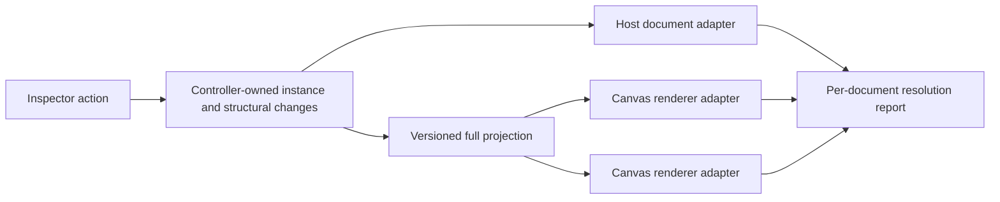

# Durable rendered-instance projection

**Status:** Proposed

## Purpose

Make an edit to one rendered item durable across refresh, Inspect, and Canvas
without changing the existing default: a normal CSS edit continues to affect
every output from its JSX source site.

The same rendered-instance identity must also make structural preview edits
(delete and move) apply to the selected item in the host document and every
matching Canvas renderer. It replaces two deliberately limited behaviours:

- `instance-preview` CSS overrides are attached to one live DOM node and are
  lost on refresh; and
- DOM moves/deletes are recorded with live node references and only affect the
  document where the gesture occurred.

This is a preview system. It never rewrites application source or state. If
React later renders contradictory structure, the tool reports that conflict
and retains the intent for prompt handoff rather than repeatedly fighting the
application.

## User model

There are two independent scopes.

| Action | Default scope | Explicit alternative |
| --- | --- | --- |
| CSS property or token edit | Every rendered output from the same source site | Edit this rendered item only |
| Delete or move | This rendered item only | No bulk structural action in v1 |

For a mapped list containing `0.1`, `0.2`, and `0.3`:

- changing the colour of `0.2` normally changes all three, as it does today;
- choosing **Edit this rendered item only** changes only `0.2` and survives a
  refresh or a Canvas/Inspect switch; and
- deleting or moving `0.2` affects only `0.2` in every projected document.

`Relink to source` removes an individual CSS override and returns future CSS
edits to the source-site scope. It does not turn a structural operation into a
bulk operation.

## Terms and invariants

`SourceSiteRef` identifies JSX instrumentation already owned by the plugin:

```ts
type SourceSiteRef = { cid: string; src: string };
```

`RenderedInstanceRef` identifies one logical rendered output of that source
site. It is durable data, not an element reference or a generated DOM ID.

```ts
type RenderedInstanceRef = {
  sourceSite: SourceSiteRef;
  locator:
    | { kind: "application-key"; attribute: string; value: string }
    | {
        kind: "evidence";
        occurrence: number;
        props: string | null;
        text: string | null;
      };
};
```

The resolver must return exactly one element, `missing`, or `ambiguous`. It
must never choose a different item merely because an ordinal fallback happens
to exist after sorting, filtering, or data changes. Evidence remains bounded
and is used only to disambiguate a source-site match; it is not presented as a
source selector.

The existing generated `data-dt-instance="iN"` value is not a
`RenderedInstanceRef`. It is a document-local implementation detail and cannot
be persisted as identity.

## Architecture

The controller remains the only owner of canonical intent under ADR-0006.
One new deep module owns capture, resolution, projection, diagnostics, and
per-document cleanup behind a small interface:

```ts
interface RenderedInstanceResolver {
  capture(element: HTMLElement): RenderedInstanceRef;
  resolve(document: Document, ref: RenderedInstanceRef): ResolutionResult;
}

interface DocumentProjectionAdapter {
  apply(projection: WorkspaceProjection): DocumentProjectionReport;
  dispose(): void;
}
```

The host document and Canvas renderer are two adapters at this seam. They use
the same resolver and report the same `applied`, `missing`, `ambiguous`, or
`overridden` outcomes. The renderer never owns a change log or decides which
item a change applies to.



### Individual CSS overrides

An **Edit this rendered item only** action creates a canonical instance CSS
override. When an adapter resolves its `RenderedInstanceRef`, it attaches a
dev-only projection marker derived from the override ID, for example
`data-dt-projection-instance="override-42"`. The marker is a per-document
projection artefact, not persisted identity. The managed stylesheet then
targets that marker.

Source-site rules are emitted before individual override rules. The individual
selector includes the source-site selector plus its projection marker, giving
the individual override deterministic precedence without inline styles. This
retains ADR-0003's managed-stylesheet contract.

### Structural changes

Structural changes are separate from CSS changes but reuse the same instance
resolver:

```ts
type StructuralChange =
  | { id: string; kind: "delete"; target: RenderedInstanceRef }
  | {
      id: string;
      kind: "move";
      target: RenderedInstanceRef;
      destination: {
        parent: RenderedInstanceRef;
        before: RenderedInstanceRef | null;
      };
    };
```

`parentTag` and sibling index are presentation data only; they are not enough
to resolve a move in another document. The controller distributes a full,
revisioned structural projection when a renderer becomes ready, reloads, or
when canonical structural state changes. It follows the validated same-origin
controller/renderer protocol already used for CSS.

Undo, redo, revert, clear, persistence, and prompt generation operate on
canonical records. Document adapters may retain physical-node placeholders as
private implementation details for a currently mounted document, but no DOM
node, renderer-local ID, or placeholder crosses the projection interface.

## Resolution and conflict policy

1. Prefer an explicit stable application key when the inspected element has
   one supplied through a documented, dev-only identity adapter.
2. Otherwise resolve source-site candidates and require the stored occurrence
   plus bounded props/text evidence to identify one candidate.
3. If resolution is not confident, do not apply the operation in that document.
   Report `missing` or `ambiguous`; never broaden an individual CSS override or
   structural change to every source-site match.
4. After application, verify the expected style or placement. A later React
   reconciliation that removes the marker, deleted node, or placement is
   `overridden`, not a reason for an infinite reapply loop.

The first release intentionally has no **delete all** or **move all** control.
Bulk delete is too destructive, and bulk move needs separate ordered-group
semantics to avoid reversing or collapsing repeated items.

## Durability, diagnostics, and prompt handoff

Eligible individual CSS overrides and structural changes are stored in the
durable session schema. Restoring a session rehydrates canonical state, then
projects it into the host and each ready frame. The schema version must change;
old `instance-preview` records remain non-durable and may be discarded rather
than silently reinterpreted.

The Changes Log shows the scope and per-document status. Prompt output contains
the source site, resolved-instance evidence, and structural intent, but never
the generated projection marker. A missing or React-overridden preview remains
actionable prompt context.

## Performance constraints

Instance resolution must not scan every document on every render, pointer move,
or style-field keystroke.

- Capture an instance reference once at the user action.
- Resolve only affected records on commit, restore, frame-ready/reload, and
  batched relevant DOM mutation.
- Maintain one cache/index and one batched observer per document, not an
  observer per override.
- Cache source-site candidate sets per document and invalidate only on relevant
  child or identity-attribute mutations.
- Send complete revisioned snapshots initially, as CSS does today; add deltas
  only after a perf harness proves snapshot size or application time is a
  problem.

The performance contract is proportional to active individual/structural
changes and ready Canvas frames, not to pointer activity or whole-page render
frequency.

## Framework scope

The core resolver is DOM- and instrumentation-based, so it does not depend on
React Fiber or internal React keys. React remains the first runtime adapter,
consistent with product scope, but a future framework can provide its own
instrumentation/application-key adapter without changing canonical instance or
structural records.

This plan retains:

- ADR-0002: all instrumentation, markers, controller state, and renderer
  protocol are dev-only;
- ADR-0003: CSS remains managed stylesheet projection with no inline styles;
- ADR-0006: controller owns canonical authority and renderers remain thin; and
- ADR-0007: component-prop projections stay separate from CSS and structural
  intent.

## Delivery sequence

| Issue | Deliverable | Depends on |
| --- | --- | --- |
| 0049 | Durable **Edit this rendered item only** CSS override | None |
| 0050 | Instance-scoped delete projected between Inspect and Canvas | 0049 |
| 0051 | Instance-scoped sibling reorder projected between Inspect and Canvas | 0050 |
| 0052 | Structural undo/revert and React-conflict diagnostics | 0051 |
| 0053 | Durable structural session restoration and prompt handoff | 0052 |
| 0054 | Optional stable application-key identity adapter | 0049 |
| 0055 | Remove legacy live-DOM mutation adapter | 0053 |

Issues 0049–0053 are the safe v1. Issue 0054 is a follow-on for data-driven
lists where source-site occurrence plus evidence is not sufficiently stable.
