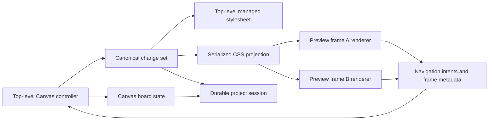

# Live Canvas workspace

**Status:** Approved implementation plan  
**Milestone:** 4 — Live Canvas workspace  
**Issues:** #0030–#0035

## Summary

Canvas is a workspace for comparing and editing multiple live routes from the
same local Vite project. The top-level controller continues to own all
selection and editing; Canvas renderers report element intents and display the
canonical changes across a board of same-origin iframe previews.

This plan replaces the snapshot-gallery direction in `PLAN.md`. Canvas v1 does
not use `html2canvas`, store PNG captures, or provide before/after snapshots.
Issue #0030 records the live-frame decision in a new ADR and aligns `PLAN.md`
before the implementation becomes authoritative.

## Product decisions

- Inspect and Canvas are separate top-level modes.
- Inspect mode contains one normal, full-page, editable route.
- Canvas mode contains live route previews whose tracked elements can populate
  the top-level Inspector and receive canonical edits.
- Choosing **Edit** on a card exits Canvas and makes that route the single
  editable page. The board remains available on the next Canvas toggle.
- Entering Canvas adds the current Inspect route if it is not already present.
- Same-origin route links add or focus Canvas cards instead of replacing the
  originating card. Hash links remain within their card.
- Exact `pathname + search` destinations are deduplicated. An explicit
  **Duplicate** action permits two cards for the same URL so responsive sizes
  or application states can be compared.
- Canvas supports only the current dev-server origin. Cross-origin pages,
  multiple dev servers, and microfrontend composition are deferred.
- Screenshot capture, frozen states, visual diffing, and PNG export are not
  part of this milestone.
- Design Tool edits are shared; host-application state is not. Each card owns
  its scroll position, forms, open menus, theme, and other runtime state unless
  the host application itself synchronises them.
- The workspace and stable edits restore automatically after refresh and remain
  until the user clears the session.
- One top-level Design Tool workspace may own a project at a time. Canvas
  iframes are renderers belonging to that workspace, not competing editors.

## User journeys

### Compare a token across routes

1. In Inspect mode, the user changes a global color token.
2. The canonical change set projects the change into the editable page.
3. The user enters Canvas. The current route appears as a live card with the
   token change already applied.
4. The user clicks a same-origin navigation link in that card. The destination
   opens as a second card and receives the complete current change projection.
5. Subsequent visits to Canvas continue to show both routes. Refresh restores
   the same board and edit.

### Edit another route

1. The user chooses **Edit** on a Canvas card.
2. Canvas state is saved and mode changes to Inspect before navigation.
3. The top-level page navigates to the card's URL and restores the stable
   canonical changes into its managed stylesheet.
4. The user edits this one page. Returning to Canvas reuses the saved board and
   updates every preview with the latest canonical projection.

### Edit directly from Canvas

1. The user selects a tracked non-navigation element inside any card.
2. The renderer reports its exact `data-cid` + `data-src` identity to the
   controller without creating local edit state.
3. The controller resolves the element in that card document and populates the
   top-level Inspector.
4. Inspector changes enter the canonical change set and project into every
   ready card, including the selected card.

### Compare responsive and application states

1. The user duplicates a card.
2. Each copy can be resized to a different iframe viewport.
3. Unmodified interactions go to the iframe, so menus, form fields, and host
   theme controls can be placed in different states independently.
4. Design Tool CSS changes continue to update both cards.

## Runtime architecture



### Controller role

The top-level document remains the only editing authority. It owns:

- the Inspector and element selection;
- canonical changes and undo/redo history;
- the managed stylesheet for the editable page;
- Canvas routes, cards, camera, and mode;
- persistence and active-workspace ownership; and
- the parent side of the preview protocol.

Canvas is rendered as a fixed Shadow DOM surface above the still-mounted host
application. Switching back to the same Inspect route can therefore preserve
the host document's runtime state. Choosing a different card for editing uses
top-level navigation and may reset ordinary application state, as normal page
navigation would.

### Embedded renderer role

Every dev HTML response currently receives the inspector bootstrap. The
bootstrap must distinguish a Design Tool Canvas iframe from a normal top-level
page. A frame is a Canvas renderer only when its same-origin `frameElement`
carries the Design Tool Canvas marker. Merely being inside any iframe is not
enough, because host applications may contain their own frames.

An embedded renderer:

- does not mount an Inspector, selection overlay, panel layout, or workspace
  lease UI;
- announces readiness and current route/title to its owning controller;
- installs one managed stylesheet in its own document;
- replaces that stylesheet from versioned controller messages;
- captures eligible route-link navigation intents; and
- reports tracked-element hover and selection intents; and
- reports full reloads and programmatic same-card navigation.

The renderer does not own canonical changes and does not persist edit state.

### Shared edit projection

The controller serializes `getPendingRules()` to CSS using the existing managed
stylesheet representation. Sending the complete CSS projection, rather than
replaying edit commands, keeps element rules, global token contexts, undo,
revert, and frame reload recovery aligned with one source of truth.

Each projection carries a monotonically increasing revision. A renderer
replaces its entire managed stylesheet only when the revision is newer. The
controller sends the latest full projection after `frame-ready` and after every
canonical change. Reloaded or HMR-replaced frames therefore converge without a
special replay path.

ADR-0003 and ADR-0005 continue to govern the CSS itself:

- no inline writes are permitted;
- every document has at most one `#design-tool-styles` element;
- element changes retain stable `data-cid` + `data-src` selectors; and
- global token changes retain their authored contextual selectors and wrappers.

Preview verification remains authoritative in Inspect mode. Canvas may report
per-frame selector matches for diagnostics, but it must not rewrite canonical
`previewResult` based on whichever preview responded last.

## Frame protocol and safety

Use a small, versioned `postMessage` protocol. Messages include protocol
version, project ID, workspace ID, card ID, and payload. Initial message types:

- `frame-ready` — renderer is ready for the latest projection;
- `replace-styles` — full CSS text plus canonical revision;
- `navigation-intent` — eligible route link requested a new card;
- `frame-metadata` — current URL and document title changed; and
- `element-hover` / `element-click` — tracked element intent for controller-owned selection; and
- `frame-diagnostic` — optional load, match, or rendering problem.

The controller sends with an explicit current-origin `targetOrigin` and accepts
messages only from the expected card's `contentWindow`. Renderers require both
`event.origin === location.origin` and `event.source === parent`. Project and
workspace identifiers prevent an unrelated same-origin window from joining a
session accidentally.

No cross-tab edit synchronisation is introduced. The eventual workspace lease
may use `storage` events or a narrowly scoped channel only to coordinate
ownership and takeover.

## Route and interaction semantics

A primary activation of a tracked non-navigation element reports a selection
intent to the controller without cancelling the application's event. Buttons,
inputs, menus, and same-document hash links therefore remain interactive while
also populating the top-level Inspector. If an application action removes the
selected source-site node, the controller clears that stale selection.

### Link discovery

The renderer observes primary, unmodified activation of same-origin anchors
whose destination changes `pathname + search`:

- prevent navigation in the source card;
- send `navigation-intent` to the controller;
- focus the existing matching card or create a card to its right; and
- preserve the URL's hash as the new card's initial location when present.

A same-document hash link retains normal in-frame scrolling. Download links,
non-HTTP schemes, modifier clicks, and explicitly targeted links retain their
browser meaning. An ordinary external `_self` link must leave Canvas rather
than strand a card on an inaccessible cross-origin document; the renderer
opens it outside the Canvas workspace.

React Router and similar `Link` components normally render anchors and follow
this path. Programmatic navigation that cannot be attributed to an anchor may
navigate the existing card; the renderer reports its new URL so persisted card
metadata stays correct. A cross-origin redirect becomes a recoverable card
error with Reload/Remove actions rather than a Canvas route.

### Card toolbar

Each card provides:

- route or document title;
- **Edit**;
- **Reload**;
- **Duplicate**; and
- **Remove**.

Link discovery deduplicates by normalized origin + pathname + search. Explicit
duplicates receive separate card IDs and independent iframe runtime state.

### Board interaction

The board is an unbounded spatial surface. The first card copies the current
browser viewport; later cards inherit the most recently used card size and are
placed to the right with a stable gap. Resizing changes the iframe's actual CSS
viewport so host responsive breakpoints behave normally.

Unmodified pointer, drag, and wheel input is reserved for cards and Canvas UI.
The board itself does not pan on an ordinary empty-background drag.

- Hold Space and drag to pan, including when starting above a frame.
- Use Ctrl/Cmd + wheel to zoom around the pointer.
- **Fit All** computes a camera transform containing every card.
- Card resize handles operate correctly at non-1 zoom.
- Entering Canvas for the first time runs Fit All, producing the intended
  zoomed-out overview.

Keyboard and pointer handling must not trap focus in the Shadow DOM or make
iframe content inaccessible. Canvas controls require labels and visible focus.

## State model

The concrete names may change during implementation, but the separation is a
contract:

```ts
interface CanvasCard {
  id: string;
  url: string;
  title: string | null;
  x: number;
  y: number;
  width: number;
  height: number;
}

interface CanvasCamera {
  x: number;
  y: number;
  zoom: number;
}

interface CanvasWorkspaceState {
  schemaVersion: 1;
  projectId: string;
  mode: "inspect" | "canvas";
  inspectUrl: string;
  cards: CanvasCard[];
  camera: CanvasCamera;
}
```

Card runtime state such as readiness, iframe window references, load errors,
and selector-match diagnostics is ephemeral and must not enter the durable
schema.

## Persistence and restoration

### Project identity

The plugin exposes a dev-only project ID derived from the resolved Vite root,
with an explicit option available for projects that need a stable override.
The browser stores only the identifier, not the absolute filesystem root.
Storage keys include project ID and schema version. Production builds expose no
project or session metadata.

### Durable data

Persist:

- Canvas/Inspect mode;
- the Inspect route;
- cards, URLs, positions, viewport sizes, and titles;
- camera position and zoom; and
- canonical source-site and global-token changes needed to rebuild rules.

Do not persist:

- undo/redo stacks;
- selection and hover state;
- frame application state or scroll positions;
- preview verification derived from a particular document; or
- runtime-only `instance-preview` changes.

Instance-only edits remain active for the current document lifetime but are
labelled as not restorable. Stable changes are serialized without transient DOM
references, validated against a versioned schema, hydrated without creating an
undo entry, and immediately projected into the top-level managed stylesheet.

Restoration is automatic. Show a compact **Restored N preview changes** notice
and a clearly available **Clear session** action. Clear removes durable Canvas
and edit state, canonical changes, managed stylesheets, history, and the current
workspace lease, then returns to a one-card Inspect baseline.

### Stale changes

A missing selector on one route is not enough to declare an edit stale: the
source site may exist only on another card. Restored element changes begin as
unverified and aggregate match reports from the editable page and ready Canvas
frames. If no current document matches, show a stale/unmatched state while
retaining the exact selector and prompt information.

Never silently delete a stale edit, convert it to a broader selector, or claim
that it painted. Token restoration should also compare persisted declaration
identity/baseline with the current catalog when available and report source
drift. The user may revert the individual change or clear the session.

Malformed, unknown-version, or structurally invalid storage must fail closed:
leave the host page usable, do not apply CSS, and offer to discard the saved
session.

## Single-workspace ownership

A top-level controller has a per-tab owner ID and acquires a project-scoped
lease before editing or opening Canvas. The lease has a heartbeat and expiry so
a crashed or closed tab cannot block the project indefinitely.

A second top-level tab runs the host application normally but does not mutate
the Design Tool session. Its Design Tool entry surface explains that another
workspace is active and offers **Take over here**. Takeover invalidates the old
owner, restores the latest durable state, and becomes the only writer. The old
owner reacts to lease loss by disabling edit/Canvas writes and presenting its
own takeover option.

Canvas renderers never acquire or refresh a lease.

## Performance and compatibility boundaries

- Same-origin Vite development routes only.
- React remains the only inspected framework, though preview rendering itself
  does not add new framework adapters.
- Cards load real application documents and therefore create real React trees,
  network requests, and Vite HMR clients. Do not silently cap the board in v1,
  but expose load failures honestly and keep projection work proportional to
  changed revisions rather than animation frames.
- Keep offscreen cards live for the first implementation so application state
  survives panning. Frame suspension/virtualisation is deferred until measured.
- Content Security Policy or application response headers may prevent framing.
  Detect failure and show a card-level explanation; do not fall back silently
  to screenshots.
- Browser storage is a preview convenience, not durable source control. Prompt
  handoff remains the path for implementing changes in source.

## Verification strategy

Every slice follows the repository verification obligations. Across the
milestone, coverage must prove:

- a production build contains no Canvas bootstrap, frame marker, session
  protocol, project ID, persistence payload, or injected identity attributes;
- a current-route frame mounts without a nested Inspector;
- source-site and contextual global-token changes project identically into
  multiple routes and recover after frame reload/HMR;
- link discovery, deduplication, explicit duplication, external/hash behavior,
  and Edit handoff work in the sandbox;
- unmodified iframe controls remain usable while modified pan/zoom gestures
  control the board;
- iframe resize exercises real responsive breakpoints;
- refresh restores the mode, board geometry, camera, and stable edits but not
  history or instance previews;
- stale state never broadens selectors or reports false success; and
- a second top-level tab cannot concurrently write without explicit takeover.

## Delivery order

| Issue | Slice | Type | Blocked by |
| --- | --- | --- | --- |
| #0030 | Live Canvas runtime and current-route preview | HITL | #0021 |
| #0031 | Shared edit projection across preview documents | AFK | #0030, #0022 |
| #0032 | Link-discovered route cards and edit handoff | AFK | #0031 |
| #0033 | Responsive spatial Canvas board | HITL | #0032 |
| #0034 | Durable Canvas and stable edit restoration | AFK | #0033 |
| #0035 | Restore safety and single-workspace ownership | HITL | #0034 |
